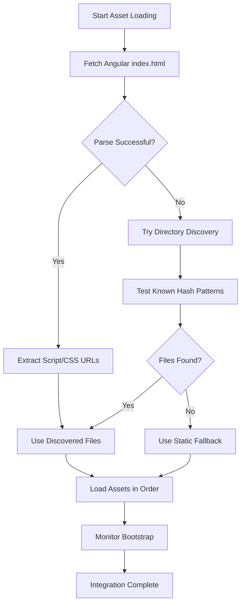

# Dynamic Asset Loading System - Developer Guide

## Overview

The SPFx + Angular integration now uses a sophisticated dynamic asset loading system that automatically handles Angular build artifacts with changing file hashes.

## Key Features

### 🔄 **Dynamic Asset Discovery**
- Automatically detects Angular build files from `index.html`
- Parses script and stylesheet references dynamically
- Works with any Angular build configuration

### 🎯 **Environment Detection**
- Automatically detects development vs production environments
- Adjusts asset paths based on current context
- Enables development-specific features like hot reload

### 🔥 **Hot Reload Support**
- Monitors file changes in development mode
- Automatically reloads Angular integration when files change
- Preserves development workflow efficiency

### 📦 **Multi-Tier Fallback System**
1. **Dynamic Discovery** - Primary method using index.html parsing
2. **Known Hash Fallback** - Uses build script-maintained hash registry  
3. **Static Fallback** - Original hardcoded paths as last resort

## How It Works

### Asset Discovery Flow



### Environment Detection

```typescript
// Automatic environment detection
const config = this.getEnvironmentConfig();
// Returns: { isDevelopment: boolean, baseUrl: string, enableHotReload: boolean }
```

### Hot Reload System

```typescript
// Development-only hot reload monitoring
if (config.enableHotReload) {
  // Watch for webpack HMR events
  // Monitor file system changes
  // Auto-refresh on updates
}
```

## Usage Examples

### Development Workflow

```bash
# Start development environment
npm start

# Angular files automatically discovered from:
# /angular-app/runtime.{hash}.js
# /angular-app/polyfills.{hash}.js  
# /angular-app/main.{hash}.js
# /angular-app/styles.{hash}.css
```

### Production Build

```bash
# Build Angular with asset reference updates
npm run build:angular:update

# Build SPFx solution
npm run build

# Angular files automatically discovered from:
# /dist/angular-app/runtime.{hash}.js
# /dist/angular-app/polyfills.{hash}.js
# /dist/angular-app/main.{hash}.js
# /dist/angular-app/styles.{hash}.css
```

### Manual Asset Update

```bash
# After any Angular build, update references
npm run update-assets
```

## Configuration

### Environment Variables

The system automatically detects environment based on:
- `window.location.hostname` (localhost = development)
- `window.location.port` (4200 = webpack dev server)

### Asset Paths

| Environment | Base Path | Description |
|-------------|-----------|-------------|
| Development | `/angular-app/` | Served by webpack dev server |
| Production | `/dist/angular-app/` | Static build output |

### Hot Reload Settings

- **Check Interval**: 5 seconds
- **Reload Delay**: 1 second (allows file writes to complete)
- **Method**: HTTP HEAD requests to detect file changes

## Error Handling

### Asset Loading Failures

```typescript
// Multi-tier fallback ensures reliability
try {
  await this.loadAngularAssets(); // Dynamic discovery
} catch (error) {
  await this.loadAngularAssetsStaticFallback(); // Known hashes
}
```

### Bootstrap Timeout

- **Timeout**: 15 seconds
- **Check Interval**: 500ms
- **Fallback**: User-friendly error message with retry option

### Network Issues

- Graceful degradation to static fallback
- Detailed error logging for debugging
- User-friendly error messages

## Debugging

### Console Output

The system provides detailed logging:

```
🔍 Discovering Angular assets dynamically...
📄 Loading Angular CSS: /angular-app/styles.6ebe757.css
📄 Loading Angular runtime: /angular-app/runtime.9b4bceb.js
📄 Loading Angular polyfills: /angular-app/polyfills.80fc3bd.js
📄 Loading Angular main: /angular-app/main.689f4f7.js
✅ All Angular assets loaded successfully
🔄 Waiting for Angular bootstrap... (1/30)
✅ Angular app successfully integrated into SPFx web part
```

### Asset Manifest

Check `dist/angular-asset-manifest.json` for current hash registry:

```json
{
  "timestamp": "2025-06-30T17:27:54.505Z",
  "hashes": {
    "runtime": "9b4bceb37d0dc2b9",
    "polyfills": "80fc3bd2f7d6428c", 
    "main": "689f4f7577df83b7",
    "styles": "6ebe7572d8605f36"
  }
}
```

## Best Practices

### Development
1. Use `npm start` for unified development environment
2. Let the system handle asset discovery automatically
3. Check console for any asset loading warnings

### Production
1. Always run `npm run build:angular:update` before final builds
2. Test the integration in a production-like environment
3. Verify asset manifest is generated correctly

### Troubleshooting
1. Check browser console for detailed error messages
2. Verify Angular builds are generating expected files
3. Test asset URLs manually if needed
4. Clear browser cache if seeing old assets

## Migration from Static Assets

If upgrading from the old hardcoded system:

1. The new system is backward compatible
2. Static fallbacks remain in place
3. No immediate action required
4. Consider using `npm run update-assets` after Angular builds

## Performance Considerations

- **Asset Discovery**: ~100-200ms overhead on first load
- **Hot Reload**: Minimal impact, development-only
- **Fallback System**: Ensures reliability without significant performance cost
- **Caching**: Browser caches assets normally, hashes ensure cache busting
